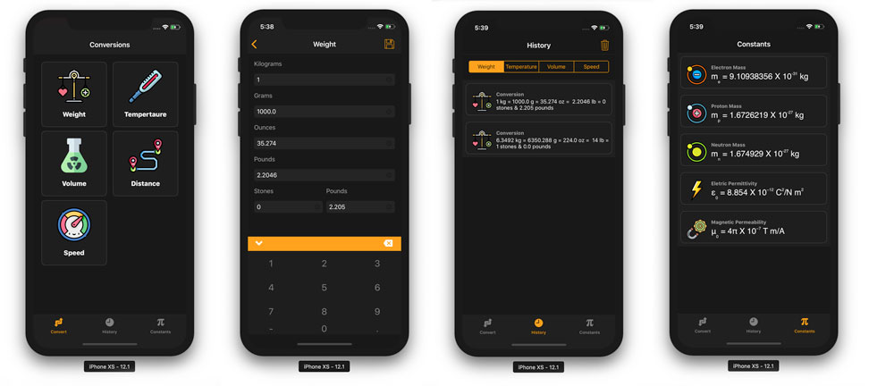

    <h1 align="center">Utitlity Converter</h1>
    
A conceptual implementation of a Unit converter app for the iPhone.

# Features

The app supports the following conversions

- Weight
  - Kilograms
  - Grams
  - Ounces
  - Pounds
  - Stone Pounds
- Temperature
  - Celsius
  - Fahrenheight
  - Kelvin
- Volume
  - Litre
  - Millilitre
  - UK Gallon
  - UK Pint
  - UK Fluid Ounce
- Distance
  - Meter
  - Centimeter
  - Millimeter
  - Mile
  - Yard
  - Inch
- Speed
  - Meters per second
  - Kilometers per hour
  - Miles per hour
  - Nautical Miles per hour

Conversions can be saved on the fly and 5 conversions per category will be persisted in the application. A view containing a list of physical constants is also available in the application.

# Built With

&nbsp;&nbsp;

<!-- ALL-CONTRIBUTORS-LIST:START - Do not remove or modify this section -->
<!-- prettier-ignore -->
| [ <b>Brion Mario</b>](https://www.linkedin.com/in/brion-mario/) [💻](https://github.com/apareciumlabs/wfwf-jquery-mobile-fe/commits?author=brionmario "Code") [📖](https://github.com/apareciumlabs/wfwf-jquery-mobile-fe/commits?author=brionmario "Documentation") [🐛](https://github.com/apareciumlabs/wfwf-jquery-mobile-fe/issues?q=author%3Abrionmario "Bug reports") [⚠️](https://github.com/apareciumlabs/wfwf-jquery-mobile-fe/commits?author=brionmario "Tests") |
| :---: |

# License

This project is licensed under the MIT License - see the [LICENSE.md](LICENSE.md) file for details.
